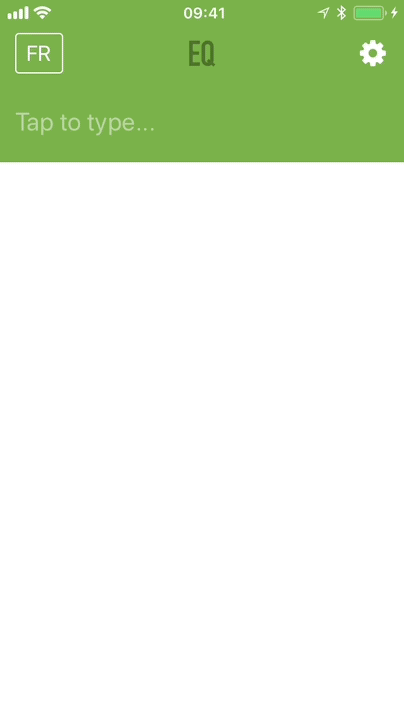

# Eloquence

When it comes to translating words to and from Russian [multitran.ru](http://multitran.ru) is probably the best dictionary available for free.
But their UI, to put it kindly, leaves a lot to be desired and there is no mobile app available.
Thus an idea to build a set of nice and easy to use apps for desktop and mobile was born.

## Mobile app

Built using [React Native](https://facebook.github.io/react-native/).



### Install on iOS

* Download [Cydia Impactor](http://www.cydiaimpactor.com) (no jailbreak required)
* Download the [latest Eloquence release](https://github.com/Igor10k/eloquence/releases/download/v1.1.0/Eloquence.ipa) and unpack it
* Connect your mobile device to your Mac
* Open Cydia Impactor and choose in the menu `Device -> Install package` and select the `Eloquence.ipa` file.
  _If you have two-factor auth enabled for your Apple ID (and you should!) then go to http://appleid.apple.com/, sign in and in the Security section generate an app-specific password to use when installing the app using Cydia Impactor_
* After install is completed in iOS go to `Settings -> General -> Profiles & Device Management -> [YOUR APPLE ID]` and tap `Trust`

### Install on Android

_To be included._

## Desktop app

Built using [Electron](https://electronjs.org/).

_To be included._

## License

```
The MIT License (MIT)

Copyright (c) 2018 Igor Kozlov

Permission is hereby granted, free of charge, to any person obtaining a copy
of this software and associated documentation files (the "Software"), to deal
in the Software without restriction, including without limitation the rights
to use, copy, modify, merge, publish, distribute, sublicense, and/or sell
copies of the Software, and to permit persons to whom the Software is
furnished to do so, subject to the following conditions:

The above copyright notice and this permission notice shall be included in
all copies or substantial portions of the Software.

THE SOFTWARE IS PROVIDED "AS IS", WITHOUT WARRANTY OF ANY KIND, EXPRESS OR
IMPLIED, INCLUDING BUT NOT LIMITED TO THE WARRANTIES OF MERCHANTABILITY,
FITNESS FOR A PARTICULAR PURPOSE AND NONINFRINGEMENT. IN NO EVENT SHALL THE
AUTHORS OR COPYRIGHT HOLDERS BE LIABLE FOR ANY CLAIM, DAMAGES OR OTHER
LIABILITY, WHETHER IN AN ACTION OF CONTRACT, TORT OR OTHERWISE, ARISING FROM,
OUT OF OR IN CONNECTION WITH THE SOFTWARE OR THE USE OR OTHER DEALINGS IN
THE SOFTWARE.
```
